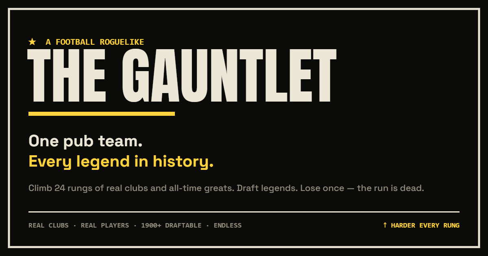

# The Gauntlet ⚽ — a football roguelike

> **One pub team. Every legend in history.**
> Inherit eleven Sunday-league nobodies and climb a 24-rung gauntlet against the greatest clubs and national sides in football history. Draft legends, forge your own club, manage tactics and fatigue — lose once and the run is dead.

**▶ Play: [beatthegauntlet.tech](https://beatthegauntlet.tech)**



---

## What it is

A single-player roguelike built around the FA-Cup giant-killing fantasy. You start with a 50-rated pub team and a procedurally generated ladder of **real clubs** — non-league → the English Football League → the Premier League → Europe's elite → all-time-great club and national XIs (the 1970 Brazil side, all-time Real Madrid, and more). Every win drops you into a **slot machine** to draft a real legend or grab a build-defining perk. One defeat ends the run. How far can you climb?

### Features
- **~1,900 real players** across Europe's top-5 leagues + the full English EFL (Championship → League Two), with opponents fielding their **actual squads**.
- **24-rung procedural ladder** — non-league to the immortals, no two climbs the same.
- **Real in-match agency:** formation & mentality, a half-time team talk, mid-match "big moment" gambles, and a pick-your-takers penalty shootout.
- **Roguelike builds:** stackable perks (Brick Wall, Goal Machine, Set-Piece Kings, Twelfth Man, Sports Science, Giant Killers) plus a fitness-battery system.
- **Forge your own club** from stereotypically-English words ("Nether Wallop Wanderers"), pick a kit, and take it to the top.
- **Brutalist editorial UI**, a synthesised WebAudio sound layer, and a generated share card for every run.

## Tech

Deliberately **vanilla** — no framework, no build step, no dependencies. Just HTML, CSS, and plain JavaScript, so it deploys as flat static files and the whole thing is readable end-to-end.

```
js/core.js    PRNG, ratings, formation fitter (max-bipartite matching), team strength
js/data.js    teams, styles, real-club tiers, the all-time XIs, the name forge, perks
js/players_generated.js   ~1,900 real players (auto-generated — see tools/import_pool.js)
js/sim.js     the match engine (xG model, half-split goals, penalties, big moments)
js/run.js     run spine — ladder, drafting, rewards, fitness batteries
js/ui.js      render helpers, the pitch, the canvas share card
js/app.js     all screen flow + the router
```

The player database is regenerated from CSVs:

```bash
node tools/import_pool.js   # reads data/csv/*.csv → js/players_generated.js
```

## Run it locally

It's static — any web server works:

```bash
node serve.js          # → http://localhost:5178
# or: python -m http.server 5178, or just open index.html
```

See [`DEPLOY.md`](DEPLOY.md) for hosting it on a global CDN with a custom domain.

## Credits & licence

A free, **non-commercial fan project** built for fun and learning. **Not affiliated with or endorsed by** any club, league, player, or EA. Real player and club data is used for educational purposes only; all names, ratings, and trademarks belong to their respective owners. The original code is free to read and learn from.
